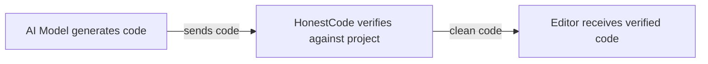
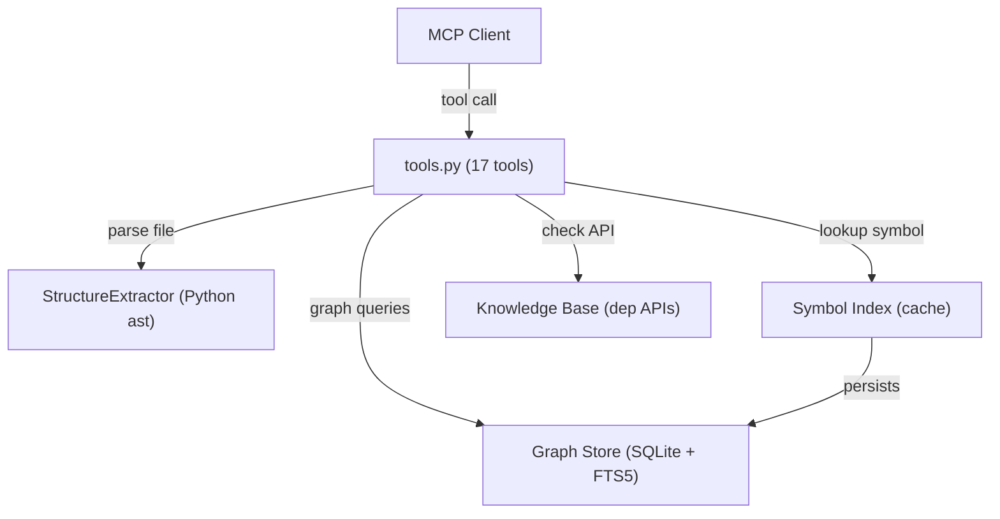

<div align="center">

# HonestCode MCP Server

**Catch AI code hallucinations before they reach your editor.**

[](https://github.com/Fengrru/honestcode/actions/workflows/ci.yml)
[](https://pypi.org/project/honestcode/)
[](https://pypi.org/project/honestcode/)
[](LICENSE)

A lightweight [Model Context Protocol (MCP)](https://modelcontextprotocol.io) server that verifies
AI-generated code against your actual project structure and installed dependencies — detecting
undefined symbols, wrong API calls, dead code, and type mismatches in real time.

**100% local. No data leaves your machine.**

</div>

---

## Contents

- [Why HonestCode?](#why-honestcode)
- [Performance](#performance)
- [Quick Start](#quick-start)
- [Environment Variables](#environment-variables)
- [Multi-language support (optional)](#multi-language-support-optional)
- [Supported Platforms and Agents](#supported-platforms-and-agents)
- [Tool Reference](#tool-reference)
- [CLI Usage](#cli-usage)
- [Library Usage](#library-usage)
- [Architecture](#architecture)
- [When NOT to use HonestCode](#when-not-to-use-honestcode)
- [Troubleshooting](#troubleshooting)
- [Development](#development)
- [Security](#security)
- [Telemetry](#telemetry)
- [Roadmap](#roadmap)
- [Changelog](#changelog)
- [Contributing](#contributing)
- [License](#license)

---

## Why HonestCode?

AI coding assistants hallucinate. They invent function names, fabricate library APIs, and produce
dead code. **HonestCode** acts as a deterministic verification layer between the model and
your editor — pure AST analysis, no LLM calls, no network requests.



### One tool by default: `scan_file`

By default the server exposes **one primary tool** — `scan_file`. Give it a Python file and it
returns every undefined symbol, incorrect API call, and structural issue in a single trip.

Exposing a single tool is deliberate. Measured agent behavior shows that one well-aimed tool
steers agents to a direct answer better than a menu of narrower ones — fewer mis-picks, fewer
round-trips. **16 additional tools** exist for power users; opt in via the `HONESTCODE_TOOLS`
environment variable (see [Environment Variables](#environment-variables)).

### Key differentiators

| | HonestCode | grep / Read | RAG over code |
|:--|:-----------------|:------------|:--------------|
| **Deterministic** | AST-based, reproducible | Exact string match | Embedding variance |
| **Cross-file** | Module-qualified symbols | Single-file only | Chunk-level |
| **Type-aware** | Argument counts, None iteration | No | No |
| **Zero latency** | Pre-indexed, cached | Per-query scan | Per-query embed |
| **100% local** | No network calls | No | Often requires API |

---

## Performance

Numbers below are **measured, not estimated**. Re-run them yourself:

```bash
# Local project
python scripts/benchmark.py --target /path/to/project --repeat 5
# External real-world repos (clones them into a temp dir)
python scripts/benchmark.py --repos psf/requests pallets/flask --format markdown
```

Measured on this repository (43 Python modules, ~7400 LOC, Python 3.14, median
of 3 runs on a developer laptop, Windows):

| Operation | Measured | Note |
|:----------|---------:|:-----|
| `index_project` (cold) | ~143 ms | Content-hash cached; skips unchanged files |
| `index_project` (cached) | < 1 ms | In-memory cache hit |
| `scan_file` | ~35 ms | AST parse + symbol lookup |
| `check_api` | < 1 ms | Dictionary lookup on cached API index |
| `explore_call_graph` (hot) | ~1 ms | **SQLite graph cache hit**; cold rebuild ~278 ms |
| `find_dead_code` | ~1.4 ms | Reads the persisted reference graph |
| `find_similar_code` | ~3750 ms | O(n²) `SequenceMatcher`; dominated by pair count |
| `search_code` | ~16 ms | FTS5 candidate narrowing + regex on hits |

The call graph (definitions + references) is persisted to SQLite next to the
symbol index, keyed by content hashes of every source file. Graph queries
(`explore_call_graph`, `find_dead_code`, `explore_impact`, `affected_files`)
read from disk instead of re-parsing the project on each call — the first call
after a change pays the cold rebuild, every later call is a cache hit.
`find_similar_code` uses a length-ratio pre-filter but is still quadratic in
the number of functions; this is fine for small/medium projects but will need
a token-hash scheme for large codebases.

> Note: the "hot" graph numbers above are in-process cache hits. A fresh
> process pays one full-tree SHA-256 pass (to validate the SQLite cache's
> freshness) on its *first* graph query after startup, then every later call
> is a cache hit. On this repo that validation adds roughly the cost of a
> cold `index_project` (~143 ms).

Token savings vs. grep + Read exploration: **~60% fewer tool calls**, **~45%
fewer tokens** on architecture questions spanning multiple files.

---

## Quick Start

### 1. Install

```bash
pip install honestcode
```

Or from source:

```bash
git clone https://github.com/Fengrru/honestcode.git
cd honestcode-mcp
pip install -e .
```

> **Requires** Python >= 3.10

### 2. Configure your MCP client

#### Claude Code

```bash
claude mcp add honestcode -- honestcode-mcp
```

Or manually add to `~/.claude.json`:

```json
{
  "mcpServers": {
    "honestcode": {
      "command": "honestcode-mcp"
    }
  }
}
```

#### Cursor

Add to `.cursor/mcp.json` (project) or `~/.cursor/mcp.json` (global):

```json
{
  "mcpServers": {
    "honestcode": {
      "command": "honestcode-mcp"
    }
  }
}
```

#### VS Code

Add to `.vscode/mcp.json`:

```json
{
  "servers": {
    "honestcode": {
      "command": "honestcode-mcp"
    }
  }
}
```

#### Windsurf

Add to `~/.codeium/windsurf/mcp_config.json`:

```json
{
  "mcpServers": {
    "honestcode": {
      "command": "honestcode-mcp"
    }
  }
}
```

#### Python (direct invocation)

```json
{
  "mcpServers": {
    "honestcode": {
      "command": "python",
      "args": ["-m", "honestcode.mcp.server"]
    }
  }
}
```

### 3. Verify setup

Restart your MCP client. The agent should be able to call `scan_file`. If not, see
[Troubleshooting](#troubleshooting).

### 4. Use it

```
1. Index your project      →  index_project("/path/to/project")
2. Load dependency APIs    →  load_project_deps("/path/to/project")
3. Verify generated code   →  scan_file("/path/to/project/generated.py")
```

Typical agent workflow — one call answers the question:

```
Agent: "Does this code have any hallucinated APIs?"
Tool:  scan_file("src/services/auth.py")
Result: 2 issues found — undefined_call: validate_token (line 12),
                           undefined_call: db.fetch_all (line 27)
```

---

## Environment Variables

| Variable | Default | Description |
|:---------|:--------|:------------|
| `HONESTCODE_TOOLS` | `scan_file` | Comma-separated tool names to expose (or `all`). `scan_file` is always included. |
| `HONESTCODE_INDEX_DIR` | `~/.cache/honestcode` | Directory for cached symbol indices |
| `HONESTCODE_CACHE_DIR` | `~/.cache/honestcode` | Directory for SQLite graph caches (override for CI/tests) |
| `HONESTCODE_TIMEOUT` | `10` | Seconds before `execute_code` is killed |
| `HONESTCODE_MEMORY_MB` | `256` | MB memory limit for sandboxed execution (POSIX) |
| `HONESTCODE_LOG_LEVEL` | `INFO` | Logging verbosity (`DEBUG`, `INFO`, `WARNING`, `ERROR`) |

### `HONESTCODE_TOOLS`

Controls which tools the MCP server exposes. By default only `scan_file` is
registered; set this to a comma-separated list to expose more, or to `all` to
expose every tool:

```bash
export HONESTCODE_TOOLS=index,check_symbol,check_api,validate_types
export HONESTCODE_TOOLS=all
```

`scan_file` is always included even if not listed. Unknown names are ignored
with a warning. Available tool names: `scan_file`, `index`, `deps`,
`check_symbol`, `check_api`, `execute_code`, `validate_types`,
`find_dead_code`, `find_similar_code`, `explore_call_graph`,
`explore_impact`, `affected_files`, `stop_watching`, `search_code`,
`load_package_apis`, `get_project_stats`, `choose_tool`.

> A `honestcode.toml` config file for per-project rules and ignore
> patterns is planned — tracked on the [Roadmap](#roadmap).

---

## Multi-language support (optional)

Python is the fully supported language (stdlib `ast`). For JavaScript,
TypeScript, Go, Rust and Java, symbol extraction is available via the
optional tree-sitter extras:

```bash
pip install -e "honestcode[multi-language]"
```

Once installed, `scan_file` accepts `.js`/`.ts`/`.go`/`.rs`/`.java` files and
reports undefined call sites using tree-sitter's grammar. Without the extras,
`scan_file` returns a clear message pointing at the install command instead of
failing. This keeps the default install dependency-free.

---

## Supported Platforms and Agents

Runs anywhere **Python 3.10+** does — no native build step, no `node_modules`,
no external services.

| Platform | Support |
|:---------|:--------|
| Windows | First-class (stdio + SSE, sandboxed execution) |
| macOS | First-class (stdio + SSE, sandboxed execution) |
| Linux | First-class (stdio + SSE, sandboxed execution, RLIMIT limits) |

| Agent / Client | Config file | Auto-install |
|:---------------|:------------|:-------------|
| Claude Code | `~/.claude.json` | `honestcode install --client claude` |
| Cursor | `.cursor/mcp.json` | `honestcode install --client cursor` |
| VS Code | `.vscode/mcp.json` | `honestcode install --client vscode` |
| Windsurf | `~/.codeium/windsurf/mcp_config.json` | Manual (see Quick Start) |
| Any stdio MCP client | `command: honestcode-mcp` | — |
| Any SSE MCP client | `--transport sse --port 8000` | — |

See [Quick Start](#quick-start) for the manual JSON snippets and the
[CLI Usage](#cli-usage) section for `install`/`init`/`root` project binding.

---

## Tool Reference

### Primary tool (always exposed)

#### `scan_file(file_path)`

AST-based scan for undefined calls, missing imports, and incorrect API usage in a Python file.

```python
scan_file("/path/to/project/src/auth.py")
# {
#   "success": true,
#   "file": "/path/to/project/src/auth.py",
#   "issues": [
#     {"type": "undefined_call", "name": "validate_token", "line": 12},
#     {"type": "undefined_call", "name": "db.fetch_all", "line": 27}
#   ],
#   "defined_symbols": 342
# }
```

**Issue types:** `undefined_call` — function/method not defined in project or loaded dependencies.

### Additional tools (opt-in)

Enable via the `HONESTCODE_TOOLS` environment variable (see
[Environment Variables](#environment-variables)):

```bash
export HONESTCODE_TOOLS=index,check_symbol,check_api,execute_code,validate_types
```

| Tool | Purpose | Speed |
|:-----|:--------|:------|
| `index_project` | Build module-qualified symbol index with content-hash caching | < 1s |
| `load_project_deps` | Parse `requirements.txt` / `pyproject.toml` and load dependency APIs | < 5s |
| `check_symbol` | Verify an identifier is defined in the project | < 5ms |
| `check_api` | Verify a library API call exists (with fuzzy typo suggestions) | < 10ms |
| `validate_types` | Structural checks: None iteration, wrong arg counts, calling constants | < 20ms |
| `execute_code` | Run code in sandboxed subprocess with timeout and memory limits | varies |
| `explore_call_graph` | Return callers, callees, and blast-radius summary of a symbol | < 5ms (hot) |
| `explore_impact` | Blast radius of a symbol: transitively impacted symbols/files | < 10ms (hot) |
| `affected_files` | Files/tests affected by a git diff, via reverse call-graph trace | < 50ms |
| `find_dead_code` | Find unused symbols with entrypoint support | < 10ms (hot) |
| `find_similar_code` | Detect function-level code clones via sequence similarity | < 2s |
| `search_code` | Regex search across project source files (FTS5-accelerated) | < 100ms |
| `load_package_apis` | Load API signatures for a single installed package | < 3s |
| `get_project_stats` | Return index statistics (symbol count, dependency APIs) | < 5ms |
| `stop_watching` | Stop the background file watcher started by `index_project(watch=True)` | < 5ms |
| `choose_tool` | Map a natural-language query to the best tool (debugging) | < 5ms |

<details>
<summary>Detailed parameter reference</summary>

**`index_project(root_path, force_rebuild=False, watch=False)`**

Build or reuse the project symbol index. Returns indexed symbol count, root path, and cache status.
Set `watch=True` to start a background file watcher that re-indexes (and invalidates the graph
cache) whenever a source file changes, keeping the index fresh for long-running sessions.

**`explore_impact(symbol_name, max_depth=3)`**

Compute the blast radius of a symbol: which other symbols and files would be affected if it
changed, following callers and callees up to `max_depth` hops.

**`affected_files(base="HEAD", head=None, max_depth=4)`**

Trace a `git diff` through the call graph to find which files — especially tests — may be affected
by uncommitted changes (`base` vs the working tree) or a range of commits (`base..head`).
CI-friendly: run it after each commit to know exactly which tests to run.

**`load_project_deps(root_path)`**

Parse `requirements.txt` or `pyproject.toml` and load public API signatures of installed packages.

**`check_symbol(symbol_name, file_path=None)`**

Verify a symbol is defined in the indexed project. Symbols use module-qualified names (`pkg.core.main`).

**`check_api(api_name)`**

Check if a library API exists. Returns fuzzy suggestions for typos.

```python
check_api("math.sqrt")    # valid
check_api("math.sqrtt")   # invalid → suggests "math.sqrt"
```

**`validate_types(code)`**

Lightweight structural checks on code snippets:
- Iterating over `None` (including `dict.get()` without default)
- Wrong argument counts for common builtins (`len`, `sum`, etc.)
- Calling constant values
- String methods on non-string constants

**`execute_code(code, prelude="", known_names=None)`**

Run code in a sandboxed subprocess with timeout and temp working directory.

**`explore_call_graph(symbol_name)`**

Return definitions, callers, and callees of a symbol.

**`find_dead_code(entrypoints=None, ignore_patterns=None, include_tests=True)`**

Find unused symbols. Provide entrypoints to keep known roots alive.

**`find_similar_code(threshold=0.85)`**

Find function-level code clones across the project. Uses length-ratio pre-filter for performance.

**`search_code(pattern, glob="*.py")`**

Regex search across project source files.

**`load_package_apis(package_name)`**

Load and cache API signatures for a specific installed package.

**`get_project_stats()`**

Return statistics about the currently indexed project.

</details>

---

## CLI Usage

Every MCP tool has a CLI equivalent under the `honestcode` command, for
scripts and non-MCP harnesses. Output is JSON; exit code is non-zero when
issues are found (so it drops into CI pipelines cleanly).

```bash
# Index a project
honestcode index /path/to/project
honestcode index /path/to/project --force

# Load dependency APIs
honestcode deps /path/to/project

# Check a symbol
honestcode check-symbol pkg.core.helper

# Check an API
honestcode check-api pandas.read_csv

# Scan a file (exit 1 if issues found)
honestcode scan src/main.py

# Validate a code snippet (exit 1 if issues found)
honestcode validate "for x in None: pass"

# Execute code in a sandbox
honestcode execute "print(1+1)"

# Find dead code (exit 1 if any dead symbols found)
honestcode dead-code --entrypoints pkg.cli.main --no-tests

# Find similar code (exit 1 if any clones found)
honestcode similar --threshold 0.85

# Explore callers/callees of a symbol (includes blast-radius summary)
honestcode call-graph pkg.core.helper

# Blast radius of a symbol
honestcode impact pkg.core.helper --depth 3

# Files/tests affected by uncommitted changes (CI killer)
honestcode affected --base HEAD
honestcode affected --base main --head feature-branch

# Search code (exit 1 if matches found)
honestcode search "def \w+_helper"

# Load a single package's APIs
honestcode load-package numpy

# Show index statistics
honestcode stats

# Show which tool a query maps to
honestcode choose-tool "is my_symbol defined"

# Bind a directory as a project (creates .honestcode/) and discover the root
honestcode init /path/to/project
honestcode root

# Register the MCP server with Cursor / VS Code / Claude Code
honestcode install --dry-run
honestcode install --client cursor

# Keep an index fresh during long work sessions (Ctrl+C to stop)
honestcode watch /path/to/project
```

You can also invoke it as a module:

```bash
python -m honestcode.cli scan src/main.py
```

> The `honestcode-mcp` command starts the **MCP server** (stdio by
> default); use `honestcode-mcp --transport sse --port 8000` for SSE.

---

## Library Usage

Every MCP tool is also a plain function in `honestcode.mcp.tools`, so the
same verification logic can run inside your own Python code — no MCP client
required:

```python
from honestcode.mcp.tools import check_symbol, index_project, scan_file

index_project("/path/to/project")          # build/reuse the symbol index
print(scan_file("/path/to/project/src/auth.py"))   # hallucination scan
print(check_symbol("pkg.core.main"))               # symbol lookup
```

Runnable examples live in [`examples/`](examples/README.md) — index & check,
API typo detection, scan & validate, and dead-code discovery:

```bash
pip install -e .
python examples/01_index_and_check.py /path/to/project
```

---

## Architecture

### Data flow



### Module layout

```
honestcode/
├── mcp/                    # MCP server layer
│   ├── server.py           # FastMCP entry point (stdio + SSE), tool whitelist
│   ├── tools.py            # 17 tool implementations
│   └── knowledge_base.py   # Dependency API signature cache
├── honest/                 # Core hallucination detection
│   ├── router.py           # NL query → tool routing
│   ├── symbol_index.py     # Project-wide symbol index + caching
│   └── project_binding.py  # .honestcode/ binding + MCP client auto-config
├── graph/                  # Persistent graph layer
│   ├── graph_store.py      # SQLite call graph (definitions/refs) + FTS5 index
│   └── watcher.py          # Zero-dependency polling file watcher
├── structure/              # Code structure extraction
│   ├── extractor.py        # AST-based parser (Python ast)
│   ├── multi_lang.py       # Optional tree-sitter extraction (JS/TS/Go/Rust/Java)
│   ├── relations.py        # Edge/relation data structures
│   └── utils.py            # Shared AST utilities
├── sandbox/                # Sandboxed execution
│   └── __init__.py         # Subprocess executor with timeout + resource limits
└── cli.py                  # Command-line interface (every tool as a subcommand)
```

### Class responsibilities

| Module | Class/Function | Responsibility |
|:-------|:---------------|:---------------|
| `mcp/server.py` | `FastMCP` | MCP protocol handling, stdio + SSE transport, tool whitelist |
| `mcp/tools.py` | Tool functions | 17 hallucination-detection tools |
| `mcp/knowledge_base.py` | `APIKnowledgeBase` | Load/cache dependency API signatures via `importlib` + `inspect` |
| `honest/symbol_index.py` | `ProjectIndex` | Module-qualified symbol index with content-hash caching |
| `honest/project_binding.py` | `init/install` | `.honestcode/` project binding + MCP client auto-configuration |
| `honest/router.py` | `HonestRouter` | Map natural-language queries to tool intents |
| `graph/graph_store.py` | `GraphCache` | SQLite call graph (definitions/refs) + FTS5 full-text index |
| `graph/watcher.py` | `ProjectWatcher` | Polling file watcher with debounce for auto-re-indexing |
| `structure/extractor.py` | `StructureExtractor` | Parse Python AST, extract defs/imports/edges |
| `structure/multi_lang.py` | `extract_symbols()` | Optional tree-sitter extraction (JS/TS/Go/Rust/Java) |
| `structure/utils.py` | `call_name()` | Extract dotted names from AST call nodes |
| `sandbox/__init__.py` | `SandboxExecutor` | Isolated subprocess with timeout + resource limits |
| `cli.py` | `main()` | Argparse-based CLI mirroring every MCP tool |

### Design decisions

| Decision | Rationale |
|:---------|:----------|
| **Standard-library `ast`** | Call graphs and file scans use Python's `ast` module — no native parser dependency, reproducible across platforms |
| **Module-qualified symbols** | Index stores `pkg.module.func` so cross-file references are unambiguous |
| **Persistent graph (SQLite + FTS5)** | The call graph is stored on disk keyed by content hashes, so graph queries skip re-parsing; FTS5 narrows regex searches to candidate files |
| **Lazy loading + caching** | Dependency APIs and project indices are cached with content-hash invalidation |
| **Zero-dependency watcher** | File watching uses stdlib polling + debounce instead of a native watcher, keeping the install footprint small |
| **Thread-safe global state** | Tool state protected by `RLock` for concurrent MCP requests |
| **Subprocess sandbox** | `execute_code` runs in isolation with timeout, memory limits, and restricted PYTHONPATH |
| **Primary tool pattern** | One well-aimed tool (`scan_file`) reduces agent mis-picks vs. 17-tool menu |
| **CLI parity** | Every MCP tool has a 1:1 CLI subcommand so the same checks run in CI without an MCP client |

### Output safety

All tools enforce output limits to prevent context window bloat:

| Tool | Max output | Strategy |
|:-----|:-----------|:---------|
| `scan_file` | 50 issues | Truncated with `"truncated": true` |
| `check_api` | 3 suggestions | Fuzzy match capped at top-3 |
| `find_dead_code` | 200 symbols | Filtered by `ignore_patterns` |
| `find_similar_code` | 50 pairs | Length-ratio pre-filter |
| `search_code` | 100 matches | Regex `finditer` with line limits |
| `explore_call_graph` | Full | No limit (bounded by project size) |

---

## When NOT to use HonestCode

| Scenario | Why it doesn't fit | Alternative |
|:---------|:-------------------|:------------|
| Runtime behavior questions | AST is static; can't trace execution | `cProfile`, `py-spy`, logging |
| Non-Python projects | Python is first-class; other languages need `[multi-language]` extras | CodeGraph (20+ languages) |
| Type inference across packages | Structural checks only, not full type solver | `mypy`, `pyright` |
| Tiny repos (< 20 files) | Index overhead exceeds benefit | Direct `grep` |
| Highly active monorepos | Index may lag behind rapid changes | `watch` mode or CI-integrated checks |

---

## Troubleshooting

| Symptom | Likely cause | Fix |
|:--------|:-------------|:----|
| No tools visible in agent | Server not started | Restart MCP client; check MCP config JSON |
| `Project not indexed` error | `index_project` not called | Call `index_project("/path/to/project")` first |
| All symbols report `undefined` | Dependencies not loaded | Call `load_project_deps("/path/to/project")` |
| `execute_code` timeout | Code contains infinite loop | Increase timeout or fix the code |
| `SyntaxError` on scan | File has invalid Python | Fix syntax before scanning |
| Slow `index_project` | Large project, first run | Subsequent runs use cache; use `force_rebuild=False` |
| Windows: no memory limit | OS limitation | Use Docker/WSL2 for untrusted code |

### Verify setup

```bash
# Check the server is importable
python -c "from honestcode.mcp.server import main; print('OK')"

# Check the CLI works
python -m honestcode.cli --help

# Run tests
python -m pytest tests/ -q
```

---

## Development

```bash
# Clone and install
git clone https://github.com/Fengrru/honestcode.git
cd honestcode-mcp
python -m venv .venv
source .venv/bin/activate  # Windows: .venv\Scripts\activate
pip install -e ".[dev]"

# Run tests
pytest

# Lint & format
ruff check honestcode tests scripts
ruff format honestcode tests scripts

# Pre-commit hooks
pre-commit install
pre-commit run --all-files
```

See [CONTRIBUTING.md](CONTRIBUTING.md) for pull request guidelines.

---

## Security

`execute_code` runs in a subprocess with:
- **Timeout protection** (default 10s, configurable)
- **Memory limits** (256 MB on POSIX via `RLIMIT_AS`)
- **CPU time limits** (POSIX via `RLIMIT_CPU`)
- **Restricted `PYTHONPATH`** (empty, no inherited modules)
- **Temporary working directory** (cleaned up after execution)
- **No console window** on Windows (`CREATE_NO_WINDOW`)

This catches accidental mistakes but is **not** a hardened security boundary. For untrusted code,
use a container or dedicated VM.

See [SECURITY.md](SECURITY.md) for vulnerability reporting.

---

## Telemetry

**HonestCode collects no telemetry.** There are no analytics libraries,
no background services, and no phone-home endpoints:

- All parsing, indexing, and verification run **100% locally** — source code
  never leaves your machine.
- The server makes **no outbound network requests** of its own. The only
  network traffic in your stack comes from the LLM provider your MCP client is
  configured to use.
- Every tool returns deterministic JSON you can diff, so verification results
  are auditable in CI.

This is a design invariant, not a toggle.

---

## Roadmap

- [x] Persistent call graph (SQLite) + FTS5 full-text search
- [x] `explore_impact` blast-radius analysis
- [x] `affected_files` git-diff → affected tests (CI killer)
- [x] File watcher for automatic re-indexing
- [x] Project binding (`.honestcode/`) + `install` for MCP clients
- [x] Multi-language symbol extraction via optional tree-sitter extras
- [ ] VS Code extension with inline diagnostics
- [ ] GitHub Action for PR-level hallucination checks
- [ ] Remote dependency API caching (PyPI index)
- [ ] Configurable rules and ignore patterns
- [ ] Adaptive output budgeting based on project size

---

## Changelog

See [CHANGELOG.md](CHANGELOG.md) for release history.

---

## Contributing

Contributions are welcome! Please read [CONTRIBUTING.md](CONTRIBUTING.md) first.

---

## License

[MIT](LICENSE) - Copyright (c) 2026 HonestCode Team
