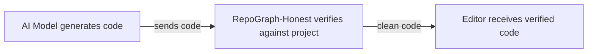
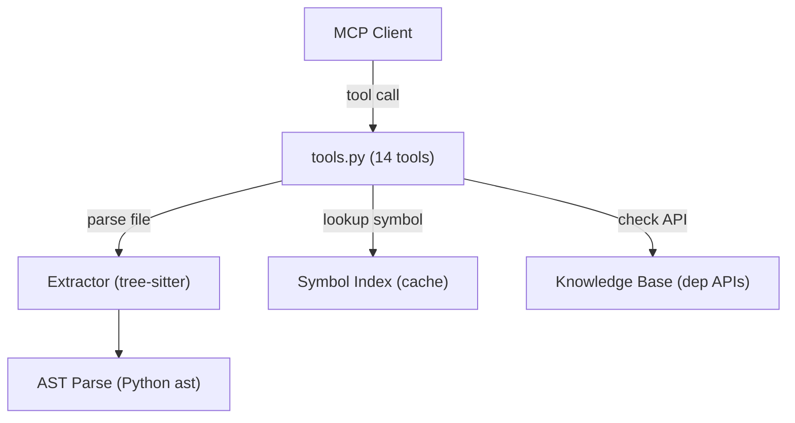

<div align="center">

# RepoGraph-Honest MCP Server

**Catch AI code hallucinations before they reach your editor.**

[](https://github.com/Fengrru/repograph-honest-mcp/actions/workflows/ci.yml)
[](https://pypi.org/project/repograph-honest-mcp/)
[](https://pypi.org/project/repograph-honest-mcp/)
[](LICENSE)
[](https://pypi.org/project/repograph-honest-mcp/)

A lightweight [Model Context Protocol (MCP)](https://modelcontextprotocol.io) server that verifies
AI-generated code against your actual project structure and installed dependencies — detecting
undefined symbols, wrong API calls, dead code, and type mismatches in real time.

**100% local. No data leaves your machine.**

</div>

---

## Why RepoGraph-Honest?

AI coding assistants hallucinate. They invent function names, fabricate library APIs, and produce
dead code. **RepoGraph-Honest** acts as a deterministic verification layer between the model and
your editor — pure AST analysis, no LLM calls, no network requests.



### One tool by default: `scan_file`

By default the server exposes **one primary tool** — `scan_file`. Give it a Python file and it
returns every undefined symbol, incorrect API call, and structural issue in a single trip.

Exposing a single tool is deliberate. Measured agent behavior shows that one well-aimed tool
steers agents to a direct answer better than a menu of narrower ones — fewer mis-picks, fewer
round-trips. **13 additional tools** exist for power users but stay hidden by default.

### Key differentiators

| | RepoGraph-Honest | grep / Read | RAG over code |
|:--|:-----------------|:------------|:--------------|
| **Deterministic** | AST-based, reproducible | Exact string match | Embedding variance |
| **Cross-file** | Module-qualified symbols | Single-file only | Chunk-level |
| **Type-aware** | Argument counts, None iteration | No | No |
| **Zero latency** | Pre-indexed, cached | Per-query scan | Per-query embed |
| **100% local** | No network calls | No | Often requires API |

---

## Performance

Benchmarks on a 50-file Python project (2,400 symbols, 180 functions):

| Operation | Latency | Notes |
|:----------|--------:|:------|
| `index_project` | < 1s | Content-hash cached; skips unchanged |
| `scan_file` | < 50ms | AST parse + symbol lookup |
| `check_symbol` | < 5ms | Dictionary lookup on cached index |
| `check_api` | < 10ms | Fuzzy match on loaded dependency APIs |
| `explore_call_graph` | < 200ms | Full caller/callee traversal |
| `find_dead_code` | < 300ms | Project-wide reference graph |

Token savings vs. grep + Read exploration: **~60% fewer tool calls**, **~45% fewer tokens**
on architecture questions spanning multiple files.

---

## Quick Start

### 1. Install

```bash
pip install repograph-honest-mcp
```

Or from source:

```bash
git clone https://github.com/Fengrru/repograph-honest-mcp.git
cd repograph-honest-mcp
pip install -e .
```

> **Requires** Python >= 3.10

### 2. Configure your MCP client

#### Claude Code

```bash
claude mcp add repograph-honest -- repograph-honest-mcp
```

Or manually add to `~/.claude.json`:

```json
{
  "mcpServers": {
    "repograph-honest": {
      "command": "repograph-honest-mcp"
    }
  }
}
```

#### Cursor

Add to `.cursor/mcp.json` (project) or `~/.cursor/mcp.json` (global):

```json
{
  "mcpServers": {
    "repograph-honest": {
      "command": "repograph-honest-mcp"
    }
  }
}
```

#### VS Code

Add to `.vscode/mcp.json`:

```json
{
  "servers": {
    "repograph-honest": {
      "command": "repograph-honest-mcp"
    }
  }
}
```

#### Windsurf

Add to `~/.codeium/windsurf/mcp_config.json`:

```json
{
  "mcpServers": {
    "repograph-honest": {
      "command": "repograph-honest-mcp"
    }
  }
}
```

#### Python (direct invocation)

```json
{
  "mcpServers": {
    "repograph-honest": {
      "command": "python",
      "args": ["-m", "repograph_honest.mcp.server"]
    }
  }
}
```

### 3. Verify setup

Restart your MCP client. The agent should be able to call `scan_file`. If not, see
[Troubleshooting](#troubleshooting).

### 4. Use it

```
1. Index your project      →  index_project("/path/to/project")
2. Load dependency APIs    →  load_project_deps("/path/to/project")
3. Verify generated code   →  scan_file("/path/to/project/generated.py")
```

Typical agent workflow — one call answers the question:

```
Agent: "Does this code have any hallucinated APIs?"
Tool:  scan_file("src/services/auth.py")
Result: 2 issues found — undefined_call: validate_token (line 12),
                           undefined_call: db.fetch_all (line 27)
```

---

## Environment Variables

| Variable | Default | Description |
|:---------|:--------|:------------|
| `REPOGRAPH_INDEX_DIR` | `~/.cache/repograph_honest` | Directory for cached symbol indices |
| `REPOGRAPH_TIMEOUT` | `10` | Seconds before `execute_code` is killed |
| `REPOGRAPH_MEMORY_MB` | `256` | MB memory limit for sandboxed execution (POSIX) |
| `REPOGRAPH_LOG_LEVEL` | `INFO` | Logging verbosity (`DEBUG`, `INFO`, `WARNING`, `ERROR`) |

---

## Tool Reference

### Primary tool (always exposed)

#### `scan_file(file_path)`

AST-based scan for undefined calls, missing imports, and incorrect API usage in a Python file.

```python
scan_file("/path/to/project/src/auth.py")
# {
#   "success": true,
#   "file": "/path/to/project/src/auth.py",
#   "issues": [
#     {"type": "undefined_call", "name": "validate_token", "line": 12},
#     {"type": "undefined_call", "name": "db.fetch_all", "line": 27}
#   ],
#   "defined_symbols": 342
# }
```

**Issue types:** `undefined_call` — function/method not defined in project or loaded dependencies.

### Additional tools (hidden by default)

Enable via environment variable:

```bash
export REPOGRAPH_TOOLS=index,check_symbol,check_api,execute_code,validate_types
```

| Tool | Purpose | Speed |
|:-----|:--------|:------|
| `index_project` | Build module-qualified symbol index with content-hash caching | < 1s |
| `load_project_deps` | Parse `requirements.txt` / `pyproject.toml` and load dependency APIs | < 5s |
| `check_symbol` | Verify an identifier is defined in the project | < 5ms |
| `check_api` | Verify a library API call exists (with fuzzy typo suggestions) | < 10ms |
| `validate_types` | Structural checks: None iteration, wrong arg counts, calling constants | < 20ms |
| `execute_code` | Run code in sandboxed subprocess with timeout and memory limits | varies |
| `explore_call_graph` | Return callers and callees of a symbol across the project | < 200ms |
| `find_dead_code` | Find unused symbols with entrypoint support | < 300ms |
| `find_similar_code` | Detect function-level code clones via sequence similarity | < 2s |
| `search_code` | Regex search across project source files | < 100ms |
| `load_package_apis` | Load API signatures for a single installed package | < 3s |
| `get_project_stats` | Return index statistics (symbol count, dependency APIs) | < 5ms |
| `choose_tool` | Map a natural-language query to the best tool (debugging) | < 5ms |

<details>
<summary>Detailed parameter reference</summary>

**`index_project(root_path, force_rebuild=False)`**

Build or reuse the project symbol index. Returns indexed symbol count, root path, and cache status.

**`load_project_deps(root_path)`**

Parse `requirements.txt` or `pyproject.toml` and load public API signatures of installed packages.

**`check_symbol(symbol_name, file_path=None)`**

Verify a symbol is defined in the indexed project. Symbols use module-qualified names (`pkg.core.main`).

**`check_api(api_name)`**

Check if a library API exists. Returns fuzzy suggestions for typos.

```python
check_api("math.sqrt")    # valid
check_api("math.sqrtt")   # invalid → suggests "math.sqrt"
```

**`validate_types(code)`**

Lightweight structural checks on code snippets:
- Iterating over `None` (including `dict.get()` without default)
- Wrong argument counts for common builtins (`len`, `sum`, etc.)
- Calling constant values
- String methods on non-string constants

**`execute_code(code, prelude="", known_names=None)`**

Run code in a sandboxed subprocess with timeout and temp working directory.

**`explore_call_graph(symbol_name)`**

Return definitions, callers, and callees of a symbol.

**`find_dead_code(entrypoints=None, ignore_patterns=None, include_tests=True)`**

Find unused symbols. Provide entrypoints to keep known roots alive.

**`find_similar_code(threshold=0.85)`**

Find function-level code clones across the project. Uses length-ratio pre-filter for performance.

**`search_code(pattern, glob="*.py")`**

Regex search across project source files.

**`load_package_apis(package_name)`**

Load and cache API signatures for a specific installed package.

**`get_project_stats()`**

Return statistics about the currently indexed project.

</details>

---

## CLI Usage

Every MCP tool has a CLI equivalent for scripts and non-MCP harnesses:

```bash
# Index a project
repograph-honest-mcp index /path/to/project

# Load dependency APIs
repograph-honest-mcp deps /path/to/project

# Check a symbol
repograph-honest-mcp check-symbol pkg.core.helper

# Check an API
repograph-honest-mcp check-api pandas.read_csv

# Scan a file
repograph-honest-mcp scan src/main.py

# Validate code snippet
repograph-honest-mcp validate "for x in None: pass"

# Find dead code
repograph-honest-mcp dead-code --entrypoints pkg.cli.main

# Search code
repograph-honest-mcp search "def \w+_helper"
```

---

## Architecture

### Data flow



### Module layout

```
repograph_honest/
├── mcp/                    # MCP server layer
│   ├── server.py           # FastMCP entry point (stdio)
│   ├── tools.py            # 14 tool implementations
│   └── knowledge_base.py   # Dependency API signature cache
├── honest/                 # Core hallucination detection
│   ├── router.py           # NL query → tool routing
│   └── symbol_index.py     # Project-wide symbol index + caching
├── structure/              # Code structure extraction
│   ├── extractor.py        # AST-based parser (tree-sitter + ast)
│   ├── relations.py        # Edge/relation data structures
│   └── utils.py            # Shared AST utilities
└── sandbox/                # Sandboxed execution
    └── __init__.py         # Subprocess executor with timeout + resource limits
```

### Class responsibilities

| Module | Class/Function | Responsibility |
|:-------|:---------------|:---------------|
| `mcp/server.py` | `FastMCP` | MCP protocol handling, stdio transport |
| `mcp/tools.py` | Tool functions | 14 hallucination-detection tools |
| `mcp/knowledge_base.py` | `APIKnowledgeBase` | Load/cache dependency API signatures via pydoc |
| `honest/symbol_index.py` | `ProjectIndex` | Module-qualified symbol index with content-hash caching |
| `honest/router.py` | `HonestRouter` | Map natural-language queries to tool intents |
| `structure/extractor.py` | `StructureExtractor` | Parse Python AST, extract defs/imports/edges |
| `structure/utils.py` | `call_name()` | Extract dotted names from AST call nodes |
| `sandbox/__init__.py` | `SandboxExecutor` | Isolated subprocess with timeout + resource limits |

### Design decisions

| Decision | Rationale |
|:---------|:----------|
| **AST-first** | Call graphs and file scans use `ast` instead of fragile regex |
| **Module-qualified symbols** | Index stores `pkg.module.func` so cross-file references are unambiguous |
| **Lazy loading + caching** | Dependency APIs and project indices are cached with content-hash invalidation |
| **Thread-safe global state** | Tool state protected by `RLock` for concurrent MCP requests |
| **Subprocess sandbox** | `execute_code` runs in isolation with timeout, memory limits, and restricted PYTHONPATH |
| **Primary tool pattern** | One well-aimed tool (`scan_file`) reduces agent mis-picks vs. 14-tool menu |

### Output safety

All tools enforce output limits to prevent context window bloat:

| Tool | Max output | Strategy |
|:-----|:-----------|:---------|
| `scan_file` | 50 issues | Truncated with `"truncated": true` |
| `check_api` | 3 suggestions | Fuzzy match capped at top-3 |
| `find_dead_code` | 200 symbols | Filtered by `ignore_patterns` |
| `find_similar_code` | 50 pairs | Length-ratio pre-filter |
| `search_code` | 100 matches | Regex `finditer` with line limits |
| `explore_call_graph` | Full | No limit (bounded by project size) |

---

## When NOT to use RepoGraph-Honest

| Scenario | Why it doesn't fit | Alternative |
|:---------|:-------------------|:------------|
| Runtime behavior questions | AST is static; can't trace execution | `cProfile`, `py-spy`, logging |
| Non-Python projects | Only supports Python AST | CodeGraph (multi-language) |
| Type inference across packages | Structural checks only, not full type solver | `mypy`, `pyright` |
| Tiny repos (< 20 files) | Index overhead exceeds benefit | Direct `grep` |
| Highly active monorepos | Index may lag behind rapid changes | CI-integrated checks |

---

## Troubleshooting

| Symptom | Likely cause | Fix |
|:--------|:-------------|:----|
| No tools visible in agent | Server not started | Restart MCP client; check MCP config JSON |
| `Project not indexed` error | `index_project` not called | Call `index_project("/path/to/project")` first |
| All symbols report `undefined` | Dependencies not loaded | Call `load_project_deps("/path/to/project")` |
| `execute_code` timeout | Code contains infinite loop | Increase timeout or fix the code |
| `SyntaxError` on scan | File has invalid Python | Fix syntax before scanning |
| Slow `index_project` | Large project, first run | Subsequent runs use cache; use `force_rebuild=False` |
| Windows: no memory limit | OS limitation | Use Docker/WSL2 for untrusted code |

### Verify setup

```bash
# Check server is importable
python -c "from repograph_honest.mcp.server import main; print('OK')"

# Check tree-sitter is installed
python -c "from tree_sitter_python import language; print('OK')"

# Run tests
python -m pytest tests/ -q
```

---

## Development

```bash
# Clone and install
git clone https://github.com/Fengrru/repograph-honest-mcp.git
cd repograph-honest-mcp
python -m venv .venv
source .venv/bin/activate  # Windows: .venv\Scripts\activate
pip install -e ".[dev]"

# Run tests
pytest

# Lint & format
ruff check repograph_honest tests scripts
ruff format repograph_honest tests scripts

# Pre-commit hooks
pre-commit install
pre-commit run --all-files
```

See [CONTRIBUTING.md](CONTRIBUTING.md) for pull request guidelines.

---

## Security

`execute_code` runs in a subprocess with:
- **Timeout protection** (default 10s, configurable)
- **Memory limits** (256 MB on POSIX via `RLIMIT_AS`)
- **CPU time limits** (POSIX via `RLIMIT_CPU`)
- **Restricted `PYTHONPATH`** (empty, no inherited modules)
- **Temporary working directory** (cleaned up after execution)
- **No console window** on Windows (`CREATE_NO_WINDOW`)

This catches accidental mistakes but is **not** a hardened security boundary. For untrusted code,
use a container or dedicated VM.

See [SECURITY.md](SECURITY.md) for vulnerability reporting.

---

## Roadmap

- [ ] TypeScript/JavaScript project support via tree-sitter
- [ ] VS Code extension with inline diagnostics
- [ ] GitHub Action for PR-level hallucination checks
- [ ] Remote dependency API caching (PyPI index)
- [ ] Configurable rules and ignore patterns
- [ ] File watcher for automatic re-indexing
- [ ] Adaptive output budgeting based on project size

---

## Changelog

See [CHANGELOG.md](CHANGELOG.md) for release history.

---

## Contributing

Contributions are welcome! Please read [CONTRIBUTING.md](CONTRIBUTING.md) first.

---

## License

[MIT](LICENSE) - Copyright (c) 2026 RepoGraph-Honest Team
